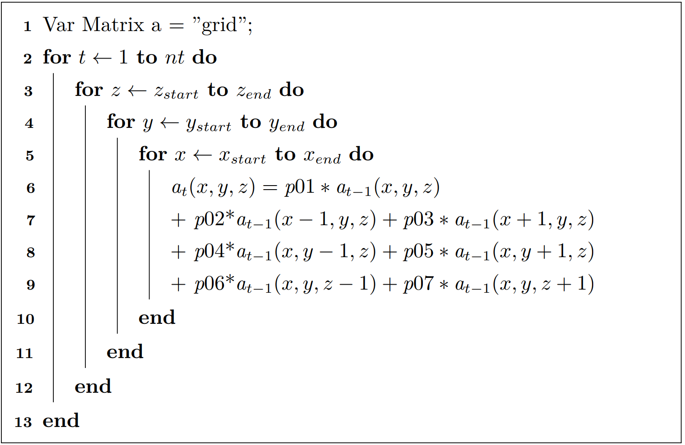

# 实验二：模板计算

负责助教：师天麾 sth19@mails.tsinghua.edu.cn、王豪杰 haojie0429@gmail.com

通过实现并行模板计算帮助熟悉 OpenMP 以及 MPI 编程 。在保证正确性的前提下，我们鼓励通过探索不同的并行化策略以优化程序性能。

## 实验任务

在本次实验中，你需要分别使用 OpenMP 与 MPI 来实现一个并行的模板计算（stencil）。模板计算是程序中常见的循环运算模式，比如熟知的热传导问题，有限差分问题等，都可以归结为模板计算问题。模板计算问题有天然的并行性，计算相对规则，访存优化和指令级并行，以及寻找算法级的时间并行性等是其主要的优化手段。熟悉模板计算的优化可以让我们更容易的将并行优化的技术应用到实际当中。

常见的模板计算包括7点模板计算和27点模板计算，在本次作业中大家只需要优化7点模板计算，其伪代码如下：

## 实验步骤

首先将实验文件 **拷贝到自己的目录** ，并进入 `PA2` 目录：

```bash
$ cp -R /home/course/hpc/assignments/2022/PA2 ~/
$ cd ~/PA2/
```

### 具体任务

修改 `stencil-omp.c` 和 `stencil-mpi.c` 文件，在这两个文件内分别使用 OpenMP 以及 MPI 实现并行化的7点模板计算。注意，MPI只需要考虑 **单机** 的实现。

### 框架介绍

在实验代码的文件夹中，`stencil-naive.c` 是基础的实现，供同学们熟悉，而 `stencil-omp.c` 和 `stencil-mpi.c` 是需要同学们修改的部分。其中 `create_dist_grid` 函数可以根据进程划分自行改动。函数中的 `halo_size` 可以理解为了方便计算，人为在最外层加了一层网格点，以避免在边界进行额外的判断与反复通信。若有同学使用的优化算法对边界有特殊要求，则可以自行修改 `halo_size` 的值。

`stencil_7` 为需要实现的模板计算。函数的前两个输入参数为两个指针，指向两个数组，在迭代过程中，这两个数组会作为滚动数组循环使用，而其中第一个数组 `grid` 存储的是初值，即初始输入的数据。两个数组外层均有额外添加 `halo`，且 `halo` 层已初始化为 0。依据迭代步数，最终的计算结果会存在其中一个数组中，请返回对应数组的指针。第三个参数是模板计算的网格维度以及 `halo` 区的信息。第四个参数是迭代的步数。

`stencil_data/`目录下是数据文件， `stencil_data_xxx`为输入文件，`stencil_answer_7_xxx_16steps`为迭代16次后的结果文件（用于检验正确性）。

### 运行流程

1. 加载环境：`spack load openmpi`。
2. 编译各个文件： `make all`（可以调整 `Makefile` 中的 `CFLAGS` 控制编译选项）。
3. 运行正确性验证脚本：
   ```bash
   $ sh test.sh <exec> <nprocs>
   ```
   其中参数 `exec` 是可执行文件名，如`benchmark-naive`；参数 `nprocs` 是进程数，执行`naive` 或  `omp` 实现的代码时该参数填1即可。
4. 运行性能测试脚本：
   ```bash
   $ sh benchmark.sh <exec> <nprocs>
   ```
   参数含义与正确性验证脚本相同。

### 测试数据

助教在 `/home/course/hpc/assignments/2022/data/public/PA2` 下也提供了3组数据可供同学测试。在提供的代码框架中，已经将此数据目录链接到了 `PA2/stencil_data` 目录中。由于数据文件较大，**禁止** 将数据拷贝到自己的目录下。

测试数据文件路径和文件名已经被写在了测试脚本中，不过默认只测试最小的一组数据，若要测试其他数据请自行修改测试脚本。

用于评分的测试数据可能并不完全是 `stencil_data` 中的数据。

### 作业提示

1. OpenMP 优化的过程中要考虑变量的共享或者私有属性，负载的分配方式，以及 NUMA 效应带来的影响。
2. MPI 优化的过程中，要考虑通讯的开销，鼓励进行计算通信隐重叠等设计。
3. stencil 计算可以参考stencilProbe （http://people.csail.mit.edu/skamil/projects/stencilprobe/），里面介绍了一些模板计算的基本优化手段。除此之外，你也可以在网上自行查找其他相关文献。
4. **如果不确定自己的优化方法或实现是否符合规则，请与助教进行讨论。**

### 注意事项

* 请统一使用双精度浮点数据类型进行计算，运算参考结果由自带的 `benchmark` 给出。
* 你修改的文件应该仅限于 `stencil-omp.c`、`stencil-mpi.c`、`mpi-nprocs` 和 `Makefile`。即使修改了其他文件（比如用于测试等目的，修改了 `test.sh` 和 `benchmark.sh` 里的内容），也要确保在 **不进行这些修改** 的情况下，程序能够正确编译运行。助教将替换所有其他文件为下发的版本后进行评测，以确保评分的正确性和公平性。`mpi-nprocs` 文件包含一个正整数（默认为28），代表你希望在最终测试MPI代码正确性和性能的时候使用的进程数。

## 分数细则

对于每一部分得分，OpenMP 与 MPI 各占一半。

在验证正确性和测试性能时，由于不同实现在不同情况下的性能表现可能不同，此部分最终的运行方式由同学确定，**OpenMP 由同学在代码中自行设置线程数，MPI 由同学在 `mpi-nprocs` 文件中自行设置进程数** 。

在验证正确性和测试性能时，迭代次数可能并不是16，但保证 `stencil-naive.c` 可以得到正确结果。

对于所有程序，只进行单机测试。

### 正确性

正确性得分共占 $60\%$，包含两部分：基础分（占 $10 \%$）和加速比得分（占 $50 \%$）。

对于基础分，如果你的代码运行结果与助教提供的串行代码（即 `stencil-naive.c`）运行结果相同，就可以获得该测试用例的基础分。有多组测试用例。你将获得通过的测试用例的分数，每组测试用例分数相同。

加速比测试只针对 `stencil_7`函数的耗时，评价标准如下：

* 对于 OpenMP/MPI 程序，如果在测试数据上该程序的`stencil_7` 相对 `stencil-naive.c` 的  `stencil_7` 的加速比 **超过 $2$** ，则加速比合格，否则加速比不合格。对于每个测试用例，只有当你 **获得了正确性基础分且加速比合格** ，方可获得该测试用例的加速比得分。

### 性能

性能得分共占 $30\%$。

* 对于每组测试用例，只有当你获得了正确性基础分和加速比得分后，才能得到性能分。每组测试用例的性能分数相同。
* 助教依旧使用你提供的OpenMP线程数和MPI进程数作为最终的性能评分依据。
* 性能测试只针对OpenMP和MPI程序的 `stencil_7` 函数。
* 根据你的性能在全体同学中的排名给出每组测试用例的分数：每组测试用例各自排名，性能排名前 $10 \%$ 的同学得到 $100 \%$ 的分数，排名 $10 \%$ - $20 \%$ 的同学得到 $90 \%$ 的分数，依此类推。对于任何测试用例，获得全部正确性分数的同学将至少获得 $10 \%$ 的性能分数。


### 实验报告

实验报告共占 $10\%$，助教根据实验报告给出分数，需要写的内容在下一章中给出。

## 实验提交

1. 实验代码：
    * 在截止日期之前将完成后的整个实验框架置于自己 home 目录下的 `PA2` 文件夹，如 `/home/course/hpc/users/2020000000/PA2`。为了节省空间， **务必删除所有自己调试用的数据文件。**
2. 实验报告：
    * 将 **PDF 文件** 提交至网络学堂（无需代码）。
    * 包含以下内容：
        1.  `stencil-omp.c` 和 `stencil-mpi.c` 文件中的 `stencil_7` 函数的源代码，并对实现简要说明（可以作为代码注释或者单独写出）。
        2. 你所做的性能优化方式（如果有）以及效果。
        3. 对 OpenMP 版本，报告使用至少4个不同的线程数（如$2$, $7$, $14$, $28$或$2$, $4$, $8$, $16$, $28$）在某组测试数据下的运行时间（3组测试数据选1组即可），及相对单线程的加速比 。
        4. 对 MPI 版本，报告使用 **单机** 至少4个不同的进程数（如$2$, $7$, $14$, $28$或$2$, $4$, $8$, $16$, $28$）在某组测试数据下的运行时间（3组测试数据选1组即可），及相对单进程的加速比 。

