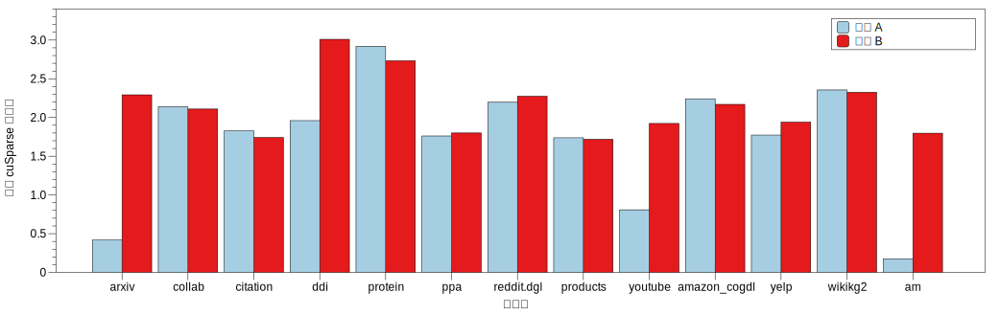

# 附加实验：稀疏矩阵-矩阵乘

负责助教：黄可钊 hkz20@mails.tsinghua.edu.cn

在本实验中，你将通过实现 GPU 加速的稀疏矩阵-矩阵乘法（SpMM）进一步熟悉 CUDA 编程以及 GPU 体系结构。

## 实验任务

### 计算公式

在SpMM中，其计算公式为 $C = A*B$，其中 $A$ 为稀疏矩阵，其形状为 $M * M$，其中包含非零元 $nnz$ 个；$B$，$C$为稠密矩阵，$B，C$ 的形状均为 $M * K$。可以用稠密矩阵乘法来理解，区别仅仅是 $A$ 中含有大量的零元。

### 存储方式

**CSR格式**：稀疏矩阵以CSR格式存储。以如下稀疏矩阵为例，可以用三个数组来存储它（均从0开始编址）。


```
PTR = [  0  2  4  7  8 ]
IDX = [  0  1  1  3  2  3  4  5 ]   
VAL = [ 10 20 30 40 50 60 70 80 ]
```

`PTR` 数组指出了哪些元素属于某一行。在上例中，`PTR[0]=0`，`PTR[1]=2`，其意思是在 `IDX` 和 `VAL` 数组中的第 `[0,2)` 个元素属于第 `0` 行。同样，`PTR[1]=2`，`PTR[2]=4`，其意思是在 `IDX` 和 `VAL` 数组中的第 `[2,4)` 个元素属于第 `1` 行。

`IDX` 数组指出了在该行上的具体位置，在上例中，我们通过读取 `PTR` 数组已经知道了 `IDX` 数组中的第 `[0,2)` 个元素属于第 `0` 行，通过读取 `IDX[0]=0` `IDX[1]=1`，我们可以知道，第 `0` 行所拥有的两个元素在第 `0` 列和第 `1` 列。

`VAL` 数组指出了其具体数值，通过读取 `VAL[0]=10` `VAL[1]=20`，可以知道，第 `0` 行的两个元素的数值是 `10` 和 `20`。

**稠密矩阵以行主序方式存储。**

## 项目介绍

```
|-- cmake
|   |-- googletest.cmake
|   `-- googletest-download.cmake
|-- CMakeLists.txt
|-- include
|   |-- args.hxx
|   |-- data.h
|   |-- dbg.h
|   |-- spmm_base.h
|   |-- spmm_cusparse.h
|   |-- spmm_opt.h
|   |-- spmm_ref.h
|   |-- util.h
|   `-- valid.h
|-- README.md
|-- script
|   `-- run.sh
|   `-- run_all.sh
|-- src
|   |-- aggregator.cu
|   |-- data.cu
|   |-- spmm_cusparse.cu
|   |-- spmm_opt.cu
|   |-- spmm_ref.cu
|   |-- util.cu
|   `-- valid.cu
`-- test
    |-- CMakeLists.txt
    |-- main.cpp
    `-- test_spmm.cu
```

其中 `spmm_base.h` 是SpMM实现的基类，`spmm_ref.*` 是效率很低的参考实现（默认并没有在 test 文件中测试），`spmm_cusparse.*` 是利用 NVIDIA 的稀疏计算库的实现，`spmm_opt.*` 是你需要实现的地方（请只修改 `spmm_opt.h` 和 `spmm_opt.cu`）。你需要实现的是 `preprocess` 和 `run` 函数。

在 `test_spmm.cu` 中，使用 Googletest 实现了多个测试项，其中有验证正确性的以及测试性能的。请在先过了正确性验证之后再运行性能测试。

## 实验步骤

```bash
spack load cuda
cp -R /home/course/hpc/assignments/2022/PA4/ ~
cd ~/PA4
mkdir build && cd build
cmake .. # 会自动clone Googletest，可能会因为网络问题很慢，可以直接从本地拷贝： cp -r /home/course/hpc/assignments/2022/googletest/ .
make -j4
# 运行单个数据点
srun ./test/unit_tests --dataset <datasetname> --len 32 # 所有的数据集在 PA4/data/ 中
# 运行全部数据点
srun ./run_all.sh # 在 PA4/scripts 目录下
# 改变环境变量，仅仅运行单个测试，例如验证正确性（Validation）
GTEST_FILTER="SpMMTest.validation" srun ./test/unit_tests --dataset <datasetname> --len 32 
```

其中 `dataset` 包含许多真实图数据（稀疏矩阵），稀疏矩阵的形状（$M$）（在代码中是`kNumV`）和非零元（$nnz$）（在代码中是`kNumE`）也被其决定。例如对于图数据 `a`，我们有两个文件，`a.config` 在同一行内存储了 $M$ 和 $nnz$，`a.graph` 第一行存储了 `PTR` 数组，第二行存储了 `IDX` 数组，`VAL` 数组在运行时随机初始化。

`--len` 决定了 $B$ 和 $C$ 的 $K$。数据在`PA4/data`中

```bash
srun ./test/unit_tests --dataset toy_graph --len 32 --datadir /home/yourname/data/
```

在测试时会测试 `len = 32, 256` 的情况。

## 实验提交

1. 实验代码：
   * 在截止日期之前将完成后的整个实验框架置于自己 home 目录下的 `PA4` 目录，如 `/home/course/hpc/users/2020000000/PA4`。
2. 实验报告：
   * 将 **PDF 文件** 提交至网络学堂。
   * 包含以下内容：
     1. 介绍你的实现方法，可以包括如何解决 ref 实现中的 warp divergence 的问题，如何利用各级缓存，如何改善数据的局部性，如何解决 Load Imbalance 的问题等；
     2. 展示不同优化对性能产生的影响，可以以单个数据集为例子详细分析
     3. 在 $len = 32, 256$ 时的运行时间，及相对于 cuSparse 实现的加速比。

## 优化 Hint

* **GPU 访存**：在 SpMM 中，稀疏矩阵的一个元素代表了对于稠密矩阵的一行的访问，所以访存量很大，需要考虑到 GPU 的访存行为（coalesce memory access）来优化
* **Warp divergence**：稀疏矩阵的元素分布不规则，会导致 reference 实现中同一个 warp 内部的线程工作量差距很大，因为 warp divergence 导致一个warp的执行时间由最慢的线程决定，而在 reference 实现中，每个线程
* **局部性**：稀疏结构带来不规则的数据访问，导致局部性很差，可以通过对图数据做预处理（在`preprocess`函数中处理，不占计算性能的运行时间；可以使用现有工具如 metis，可以自己实现），改变图数据结构，增加局部性；
* **负载不均衡**：可以自己预处理图结构，来减少它的不规则性，优化计算过程中的 load imbalance 的问题

## GPU 优化技巧

* 可以通过 GPU profiling 工具 nvprof 对程序进行profile

```bash
# 得到程序运行的总结，包括整个程序运行过程中，各个 kernel 以及 CUDA API 的执行时间和次数
srun nvprof ./test/unit_tests xxxxxxxxxx
# 要 profile 单个 kernel 的执行情况，通过 --kernels 指定要profile的kernel的名称；通过 --metrics 指定要profile 的是什么 metric，如 dram_read_bytes, achieved_occupancy等，也可以指定为 all 来得到所有的 metric
srun nvprof --kernels "KERNEL1|KERNEL2" --metrics "METRIC1|METRIC2" ./test/unit_tests xxxxxxxxxx
```

关于可以 profile 得到的 metric 以及 nvprof 更高级的使用方法可以参考 https://docs.nvidia.com/cuda/profiler-users-guide/index.html

## 往届实现



图中显示了不同的实现在不同数据集上相对 cuSparse 的加速比（`K`为32），同学 A 通过改变线程映射的方式，基本消除了 Warp divergence 的问题，其代码量相比于 naive 实现仅有小于 20 行不同；同学 B 在 CPU 上预处理了稀疏矩阵，在一些不规则的数据集上，如 arxiv，取得了更多的提升。

## 评分

数据集分为两个部分，一个部分是同学们可见的（`/home/course/hpc/assignments/2022/data/public/PA4`），一部分仅在助教测试时使用。最后性能得分会综合在两个数据集上的性能给出，主要以可见的数据集评分。

性能和报告占比 $100 \%$。评分过程中以性能为主，如果使用的方法有 novelty 并在报告中体现了出来可以有额外加分。

**严格查重，如果有任何参考借鉴，请在报告中写出来。**

## 意见反馈

关于本作业和集群 GPU 使用的问题可以在共享文档中反馈，助教会每天 check ，热心的同学也可以帮忙回答，共创良好讨论氛围。

【腾讯文档】高性能作业 PA4 反馈
https://docs.qq.com/doc/DQURXTEF3dldBV0pC